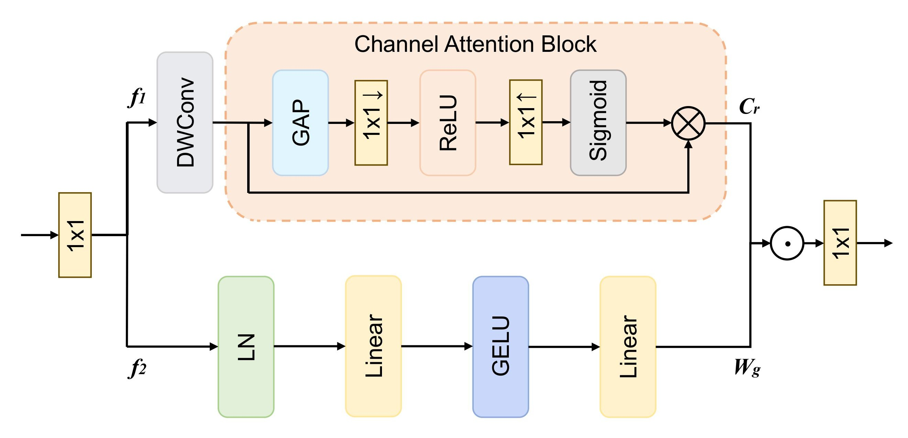
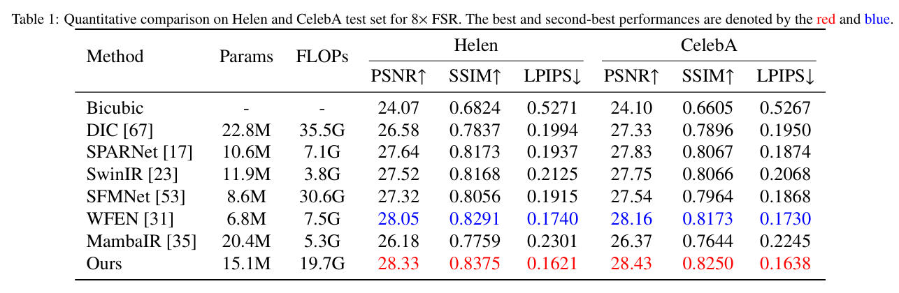

# HybriMamba: Mamba-based Face Super-Resolution of Efficient Global Feature Modeling and High-Frequency Information Recovery

> **Abstract**：Face super-resolution (FSR) aims to restore clear and realistic high-quality face images from low-quality ones, which demands simultaneous preservation of facial symmetry, global proportion and pore-level detail. CNN-based methods suffer from limited receptive fields, leading to geometric distortion and over-smoothed skin, while Transformers introduce quadratic complexity due to self-attention that hinders high-resolution inference. The recently proposed Mamba achieves linear complexity, yet its native 1-D scanning breaks 2-D facial adjacency and lacks frequency-aware degradation modeling, easily yielding asymmetric features and missing high-frequency details. To address these problems, we propose HybriMamba, a linear-complexity face super-resolution framework that equips Mamba with an Image-Selective Scan Module (Image-SSM) that restores pixel adjacency and enforces horizontal facial symmetry, a Fourier–Wavelet Transform Module (FWM) that globally modulates magnitude spectra and directionally processes wavelet sub-bands to recover fine facial details, and a Local Enhancement Module (LEM) with pixel-wise gating that adaptively re-weights smooth and textured regions to avoid over-smoothing. Embedded in a U-shaped multi-scale encoder–decoder, HybriMamba hierarchically retains facial geometry while injecting micro-textures through skip connections. Extensive experiments on Helen and CelebA show that HybriMamba achieves the best PSNR, SSIM and LPIPS among state-of-the-art methods, delivering identity-faithful and visually pleasing results.

## 🏗️ Network Architecture





## 📦 Installation
```bash
git clone https://github.com/LateAutu/HybriMamba.git
cd HybriMamba
```

We have trained and tested our codes on Python=3.9, Pytorch=2.5.1, and CUDA=12.1.
```bash
# 1. Create a virtual environment (optional)
conda create -n HybriMamba python=3.9
conda activate HybriMamba

# 2. Install dependencies
pip install -r requirements.txt
```

## 🏋️ Training
We use CelebA dataset to train our HybriMamba. The training commands are provided in script `train.sh`.
1. You should download [CelebA](http://mmlab.ie.cuhk.edu.hk/projects/CelebA.html) to train our model. Please change the `--dataroot` to the path where your training images are stored.
2. If there's not enough memory, you can turn down the `--batch_size`.
3. You can use `--continue_train` option to resume training from the last saved checkpoint.
4. `--gpus` specify the number of GPUs used to train. To specify the GPU index, change the `export CUDA_VISIBLE_DEVICES=`.
5. Logs will be saved to the `check_points` folder, and model weights will be stored in the `ckpt` folder.
```bash
# Training codes 
export CUDA_VISIBLE_DEVICES=0,1,2
nohup python train.py --gpus 3 --name Mamba-SRx8 --model Mamba \
    --Gnorm "bn" --lr 0.0004 --beta1 0.9 --scale_factor 8 --load_size 128 \
    --dataroot /data/caojianan/CelebA/celeba_train --dataset_name celeba \
    --batch_size 32 --total_epochs 100 --visual_freq 100 --print_freq 10 \
    --save_latest_freq 500 &
    # --continue_train
```

## 🧪 Testing
We use Helen and CelebA datasets to test our HybriMamba. The testing commands are provided in script `test.sh`.
1. Please change the `--dataroot` to the path where your testing images are stored.
2. Please change the `--pretrain_model_path` to the path where your model weights are saved.
3. Results will be saved to the directory specified by `--save_as_dir`.
```bash
# Testing codes on Helen
export CUDA_VISIBLE_DEVICES=4
python test.py --gpus 1 --model Mamba --name Mamba-SRx8 \
    --load_size 128 --dataset_name single --dataroot /data/caojianan/Helen/LR \
    --pretrain_model_path ./ckpt/latest_demo_model.pt \
    --save_as_dir result/Mamba-helen
```
```bash
# Testing codes on CelebA
export CUDA_VISIBLE_DEVICES=4
python test.py --gpus 1 --model Mamba --name Mamba-SRx8 \
   --load_size 128 --dataset_name single --dataroot /data/caojianan/CelebA/celeba_test/LR \
   --pretrain_model_path ./ckpt/latest_demo_model.pt \
   --save_as_dir result/Mamba-celeba
```

## 📊 Evaluation

We provide three lightweight scripts to quantitatively evaluate **PSNR / SSIM**, **LPIPS**, and **Params & FLOPs**.
1. To test PSNR & SSIM, run the following command:
```bash
python psnr_ssim.py <GT_IMG_DIR> <SR_IMG_DIR>
```
- `<GT_IMG_DIR>`: ground-truth images  
- `<SR_IMG_DIR>`: super-resolution results produced by `test.sh` (i.e. the folder you set via `--save_as_dir`)

2. To test LPIPS, run the following command:
```bash
python calc_lpips.py <GT_IMG_DIR> <SR_IMG_DIR>
```

3. To test Params & FLOPs, run the following command:
```bash
python param.py
```

## 📈 Results
### Quantitative Results（8× FSR）


### Qualitative Results (8× FSR) on Helen


### Qualitative Results (8× FSR) on CelebA

